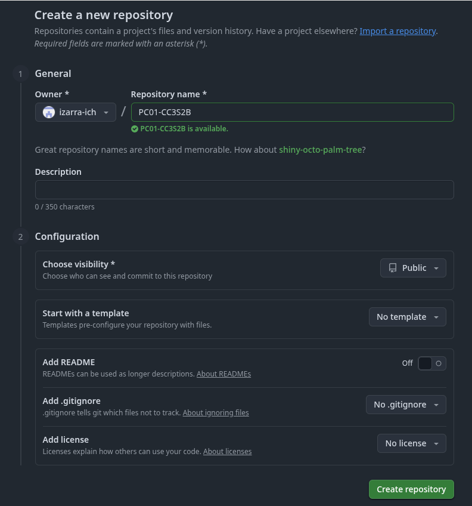
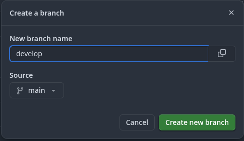
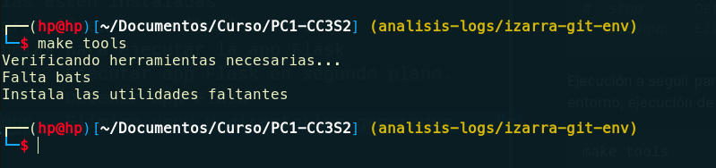
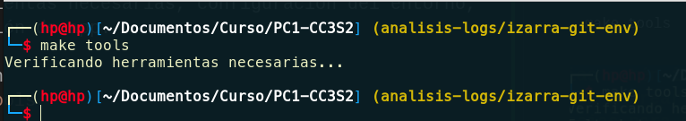
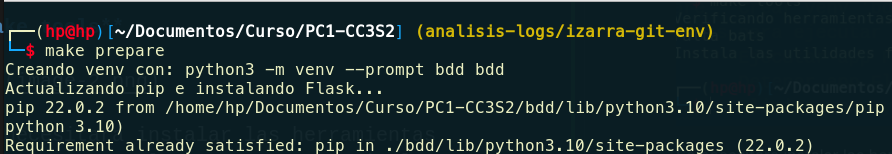
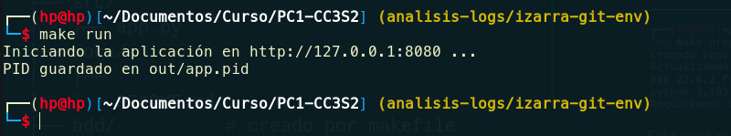
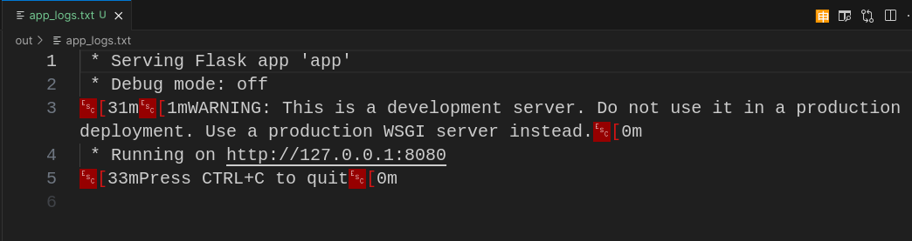
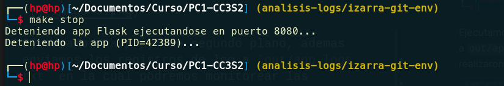
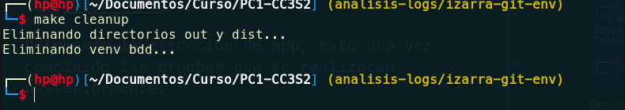

## 1. Git y env, Makefile

### Inicialización de git para repositorio

Se creo el repositorio y la estructura del proyecto con los siguientes comandos

```bash
# Creación de la carpeta del proyecto y navegación hacia ella
mkdir PC1-CC3S2 && cd PC1-CC3S2

# inicializamos git en el proyecto
git init

# Creamos los ficheros iniciales para el proyecto
echo "Proyecto 5: Analizador de logs de red con seguridad integrada" > README.md
echo ".idea/" > .gitignore

# Confirmamos cambios y generamos commit
git add .
git commit m -"Commit inicial"

# Agregar al remoto
git remote add origin https://github.com//izarra-ich/PC1-CC3S2.git

# Subimos en la rama main
git push -u origin main
```

### Configuración del proyecto en `Github` 

Creación del repositorio



Luego subimos el repositorio local inicial(en el paso anterior) para generar la rama develop, desde el cual se trabajara en el desarrollo del proyecto.



### Variables de entorno que se utilizaran
| VARIABLE   | EJEMPLO         | DESCRIPCIÓN                           |
|------------|------------------|---------------------------------------------|
| PORT       | 8080             | Puerto en el que escucha el servidor de prueba |
| RELEASE    | v0            | Nombre de version de server (app)          |
| APP_NAME | flask-app       | Nombre de la aplicación      |
| MESSAGE    | Método HTTP GET  | Maneja mensajes a personalizar para respuestas   |

### Configuración del entorno

implementamos `src/app.py` el cual es una aplicación `Flask` sobre lo cual se realizaran el `Analizador de logs de red con seguridad integrada`, ademas de implementar `targets` en el archivo Makefile para poder configurar el entorno de desarrollo.

Se muestra los `targets` implementados

```bash
make help
## Resultado:
#Make targets:
#  help      Muestra los targets disponibles
#  tools     Verifica que las herramientas necesarias estén instaladas
#  prepare   Crear venv 'bdd' e instalar dependencias para ejecutar la app Flask
#  run       Ejecutar app Flask en segundo plano.
#  stop      Detener app Flask
#  cleanup   Elimina venv y directorios generados
```

Ejecución a seguir para iniciar verificación de herramientas necesarias, configuración del entorno, ejecución de app.

1. **make tools**

    

    Se necesitara instalar las herramientas faltantes manualmente o se puede implementar otro `target` para automatizar la instalación de estas.

    ```bash
    sudo apt install bats
    ```

    

2. **make prepare**

    

    Esto crea el entorno virtual de python, `bdd` en la cual se instalaran las dependencias de la app `Flask`, ademas de crear los directorios `out` y `dist` para registrar los archivos de salida según sea el caso.

    ```
    .
    ├── Makefile
    ├── src/
    │   ├── app.py
    ├── docs/
    │   ├── 
    │   └── README.md
    ├── bdd/          # creado por makefile
    ├── out/          # creado por makefile
    └── dist/         # creado por makefile
    ```

3. **make run**

    

    Ejecutamos `app.py` en segundo plano, ademas enviamos los registros de log a `out/app_logs.txt` en la cual podremos monitorear las peticiones que se realizaron a nuestra app.

    

    Una vez esto, ejecutaremos los siguientes `targets` que se piden para realizar las pruebas sobre el app en ejecución

4. **make stop**

    

    Detenemos la ejecución de app, esto una vez concluido las pruebas que se realizaran posteriormente.

5. **make cleanup**

    

    Limpia el entorno de desarrollo que se configuro, eliminando los directorios `bdd`(entorno virtual de python), `out` y `dist`